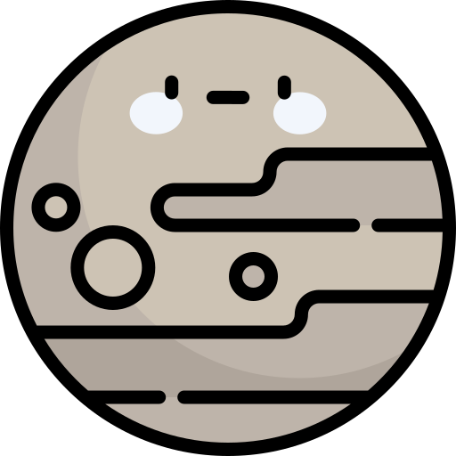

# Pluton

Pluton n'est pas dans notre système solaire.

Icone créée par [monkik](https://www.flaticon.com/authors/monkik) trouvée sur [flaticon](https://www.flaticon.com/).

## Caractéristiques

- Masse : 3.301 x 1023 kg
- Diamètre : 4879.4 km
- Distance au soleil :
  - Aphélie : 7 x 107 km
  - Périhélie : 4.6 x 107 km
  - Demi-grand axe : 5.8 x 107 km
- Symbole : &#x263F;
